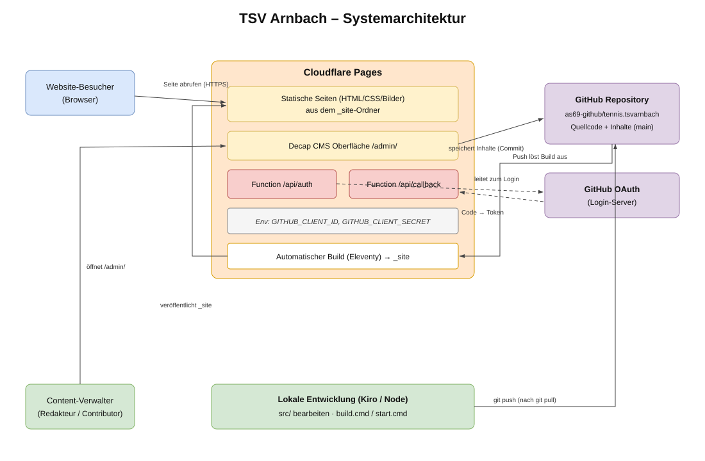
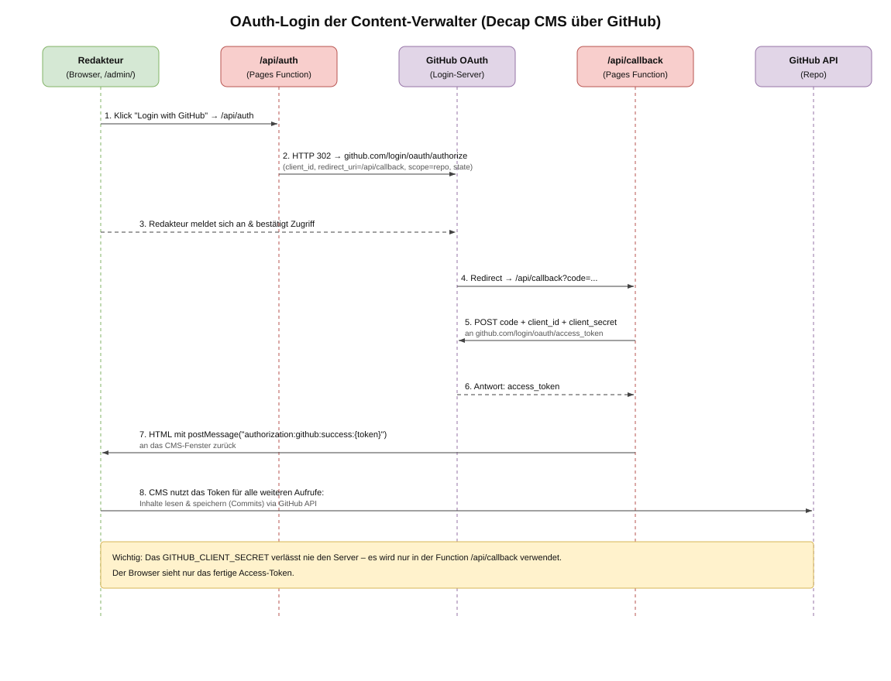
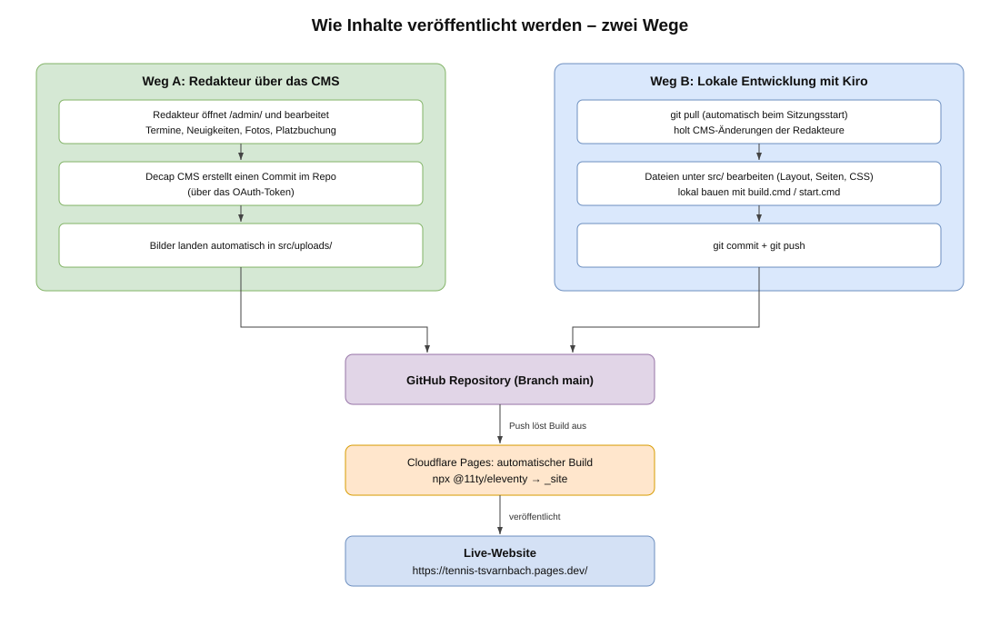

# Projektdokumentation – Vereins-Website TSV Arnbach

Diese Dokumentation beschreibt Aufbau, Technik und Abläufe der Website
des TSV Arnbach 1951 e.V. Sie richtet sich an alle, die die Seite technisch
betreuen oder weiterentwickeln.

## Inhalt

1. [Überblick](#überblick)
2. [Technologie-Stack](#technologie-stack)
3. [Systemarchitektur](#systemarchitektur)
4. [Verzeichnisstruktur](#verzeichnisstruktur)
5. [Schnittstellen](#schnittstellen)
6. [OAuth-Authentisierung der Content-Verwalter](#oauth-authentisierung-der-content-verwalter)
7. [Wie Inhalte veröffentlicht werden](#wie-inhalte-veröffentlicht-werden)
8. [Lokale Entwicklung](#lokale-entwicklung)
9. [Konfiguration & Geheimnisse](#konfiguration--geheimnisse)
10. [Diagramme (DrawIO)](#diagramme-drawio)

---

## Überblick

Die Website ist eine **statische Seite**, die mit dem Generator
[Eleventy (11ty)](https://www.11ty.dev/) aus Quelldateien erzeugt und auf
**Cloudflare Pages** kostenlos gehostet wird. Inhalte pflegen die Redakteure
über [Decap CMS](https://decapcms.org/) unter dem Pfad `/admin/` – ganz ohne
Programmierkenntnisse.

- **Live-Website:** https://tennis-tsvarnbach.pages.dev/
- **Quellcode & Inhalte:** GitHub-Repository `as69-github/tennis.tsvarnbach`
- **Redaktions-Oberfläche:** https://tennis-tsvarnbach.pages.dev/admin/

## Technologie-Stack

| Baustein            | Rolle                                                        |
| ------------------- | ------------------------------------------------------------ |
| Eleventy (11ty) v3  | Statischer Site-Generator (Quelle `src/` → Ausgabe `_site/`) |
| Nunjucks (`.njk`)   | Templating für Layouts und Seiten                            |
| Decap CMS           | Redaktionsoberfläche unter `/admin/`                         |
| Cloudflare Pages    | Hosting + automatischer Build bei jedem Push                 |
| Cloudflare Functions| OAuth-Login-Vermittlung (`/api/auth`, `/api/callback`)       |
| GitHub              | Versionsverwaltung, Speicher für Inhalte, OAuth-Anbieter     |

## Systemarchitektur



*Bearbeitbare Quelle: [`architektur.drawio`](./architektur.drawio)*

Kurz zusammengefasst:

- **Besucher** rufen die statischen Seiten direkt von Cloudflare Pages ab.
- **Redakteure** öffnen `/admin/`, melden sich per GitHub an (siehe OAuth) und
  bearbeiten Inhalte. Decap CMS schreibt diese Änderungen als Commits ins
  GitHub-Repository.
- Jeder **Push** ins Repository (egal ob vom CMS oder aus der lokalen
  Entwicklung) löst bei Cloudflare Pages einen **automatischen Build** aus.
  Eleventy erzeugt daraus die statischen Seiten, die dann live gehen.

## Verzeichnisstruktur

```
webseite/
├─ src/                     Quelldateien (hier wird gearbeitet)
│  ├─ _data/verein.json     Zentrale Vereinsdaten (Name, E-Mail, ...)
│  ├─ _includes/            Layouts (base.njk) und Teil-Templates
│  ├─ admin/                Decap CMS: index.html + config.yml
│  ├─ assets/               CSS und Bilder
│  ├─ uploads/              Über das CMS hochgeladene Bilder
│  ├─ index.njk             Startseite
│  ├─ termine.njk           Übersicht Termine  (+ Ordner termine/)
│  ├─ turniere.njk          Übersicht Turniere (+ Ordner turniere/)
│  ├─ fotos.njk             Übersicht Fotoalben (+ Ordner fotos/)
│  ├─ neuigkeiten.njk       Übersicht Neuigkeiten (+ Ordner neuigkeiten/)
│  ├─ platzbuchung.md       Einzelseite: Anleitung Platzbuchung
│  └─ ueber-uns.njk         Über uns + Impressum
├─ functions/api/           Cloudflare Pages Functions (OAuth)
│  ├─ auth.js               Startet den GitHub-Login
│  └─ callback.js           Tauscht Code gegen Access-Token
├─ eleventy.config.cjs      Eleventy-Konfiguration (Filter, Collections)
├─ build.cmd / start.cmd    Bauen / lokaler Server (umgeht npm-Sperre)
├─ _site/                   Generierte Seite (NICHT bearbeiten, nicht in Git)
└─ docs/                    Diese Dokumentation
```

> **Wichtig:** Immer nur Dateien unter `src/` bearbeiten. Der Ordner `_site/`
> wird bei jedem Build neu erzeugt und ist von Git ausgeschlossen.

## Schnittstellen

### 1. HTTP – Besucher zur Website

Reine Auslieferung statischer Dateien über HTTPS durch Cloudflare Pages.
Keine serverseitige Logik, keine Datenbank.

### 2. `/api/auth` (Cloudflare Pages Function)

- **Zweck:** Startet den GitHub-OAuth-Login.
- **Eingang:** Aufruf aus dem CMS (`/admin/`).
- **Verhalten:** Leitet den Browser per HTTP 302 zur GitHub-Autorisierungsseite
  weiter und übergibt `client_id`, `redirect_uri` (= `/api/callback`),
  `scope=repo` und einen zufälligen `state`.
- **Benötigt:** Umgebungsvariable `GITHUB_CLIENT_ID`.

### 3. `/api/callback` (Cloudflare Pages Function)

- **Zweck:** Schließt den OAuth-Login ab.
- **Eingang:** GitHub ruft diese Adresse mit einem `code` auf.
- **Verhalten:** Tauscht den `code` serverseitig gegen ein `access_token`
  (POST an GitHub) und gibt es per `postMessage` an das CMS-Fenster zurück.
- **Benötigt:** `GITHUB_CLIENT_ID` und `GITHUB_CLIENT_SECRET`.

### 4. GitHub API (durch Decap CMS genutzt)

Mit dem erhaltenen Access-Token liest und schreibt das CMS direkt über die
GitHub-API: Inhalte werden als Commits im Branch `main` gespeichert.

## OAuth-Authentisierung der Content-Verwalter



*Bearbeitbare Quelle: [`oauth-flow.drawio`](./oauth-flow.drawio)*

Warum dieser Weg? Decap CMS mit GitHub-Backend benötigt einen Vermittler
(OAuth-Proxy), weil GitHub den Login nicht direkt aus einer statischen Seite
erlaubt. Statt eines Drittanbieters übernehmen das zwei kleine
**Cloudflare Pages Functions**, die im selben Projekt liegen.

Ablauf in Kurzform:

1. Redakteur klickt in `/admin/` auf **Login with GitHub**.
2. `/api/auth` leitet zu GitHub weiter.
3. Redakteur meldet sich an und bestätigt den Zugriff auf das Repository.
4. GitHub ruft `/api/callback` mit einem einmaligen `code` auf.
5. `/api/callback` tauscht den `code` (zusammen mit dem geheimen
   `GITHUB_CLIENT_SECRET`) gegen ein **Access-Token**.
6. Das Token geht per `postMessage` zurück an das CMS.
7. Das CMS nutzt es fortan für alle Lese-/Schreibzugriffe auf das Repository.

**Sicherheitshinweis:** Das `GITHUB_CLIENT_SECRET` verlässt niemals den Server.
Es wird ausschließlich in der Function `/api/callback` verwendet. Der Browser
sieht nur das fertige Access-Token. Wer Inhalte speichern können soll, muss als
**Collaborator** Schreibrechte auf das GitHub-Repository haben.

## Wie Inhalte veröffentlicht werden



*Bearbeitbare Quelle: [`content-flow.drawio`](./content-flow.drawio)*

Es gibt zwei Wege:

- **Weg A – Redakteur über das CMS:** Änderungen unter `/admin/` werden vom CMS
  als Commit gespeichert; Bilder landen in `src/uploads/`.
- **Weg B – Lokale Entwicklung mit Kiro:** Dateien unter `src/` bearbeiten,
  lokal bauen, dann `git commit` + `git push`.

Beide Wege enden im GitHub-Repository. Jeder Push löst den automatischen
Cloudflare-Build aus, der die Seite neu generiert und veröffentlicht.

> **Zusammenarbeit:** Vor lokaler Arbeit immer `git pull`, damit die
> CMS-Änderungen der Redakteure lokal vorliegen. Ein Hook
> (`.kiro/hooks/git-pull-on-start.json`) erledigt das automatisch beim
> Sitzungsstart.

## Lokale Entwicklung

Voraussetzung: [Node.js](https://nodejs.org/) ist installiert.

- **Server mit Live-Vorschau:** `start.cmd` → http://localhost:8080/
- **Einmal bauen:** `build.cmd` → Ergebnis in `_site/`

Die `.cmd`-Dateien rufen Eleventy direkt über Node auf und umgehen damit die
PowerShell-Sperre, die `npm` auf diesem System blockiert.

## Konfiguration & Geheimnisse

| Wert                   | Ort                                              |
| ---------------------- | ------------------------------------------------ |
| `repo`, `branch`, `base_url` | `src/admin/config.yml` (Decap-Backend)     |
| `GITHUB_CLIENT_ID`     | Cloudflare Pages → Environment variables         |
| `GITHUB_CLIENT_SECRET` | Cloudflare Pages → Environment variables (Secret)|
| GitHub OAuth App       | GitHub → Settings → Developer settings → OAuth Apps |

Die OAuth-App muss als **Authorization callback URL**
`https://tennis-tsvarnbach.pages.dev/api/callback` eingetragen haben. Wird die
Domain geändert, müssen `base_url` (in `config.yml`) und die Callback-URL
angepasst werden.

## Diagramme (DrawIO)

Jedes Diagramm liegt in zwei Formaten vor:

- Eine **`.svg`-Datei** – direkt in dieser Doku eingebettet und in jedem
  Browser/Markdown-Viewer (inkl. GitHub) darstellbar.
- Eine **`.drawio`-Datei** – zum Bearbeiten mit
  [diagrams.net](https://app.diagrams.net/) oder der VS-Code-/Kiro-Erweiterung
  „Draw.io Integration".

| Diagramm                        | Ansicht (SVG)                          | Bearbeiten (DrawIO)                          |
| ------------------------------- | -------------------------------------- | -------------------------------------------- |
| Gesamtarchitektur               | [`architektur.svg`](./architektur.svg) | [`architektur.drawio`](./architektur.drawio) |
| OAuth-Login der Content-Verwalter | [`oauth-flow.svg`](./oauth-flow.svg) | [`oauth-flow.drawio`](./oauth-flow.drawio)   |
| Veröffentlichungswege           | [`content-flow.svg`](./content-flow.svg) | [`content-flow.drawio`](./content-flow.drawio) |

> Wird ein `.drawio`-Diagramm geändert, sollte die zugehörige `.svg` neu
> exportiert werden (in diagrams.net über *Datei → Exportieren als → SVG*),
> damit die Einbettung in dieser Doku aktuell bleibt.
